# RL-SAGE
## Reinforcement Learning Self-Adaptive Generation Engine

RL-SAGE is a self-improving reasoning model training framework.

It generates its own tasks.

It solves those tasks with a trainable language model policy.

It evaluates the generated answers.

It turns the evaluation into a scalar reward.

It improves the policy with reinforcement learning.

It saves both model adapters and engine state so training can resume.

It is designed around a practical single-GPU target of roughly 6 GB VRAM.

The project is intentionally modular.

Each major idea is implemented in a separate file.

The curriculum controls what the model sees next.

The task generator creates new training problems.

The solution generator asks the policy to solve them.

The evaluator checks correctness.

The reward model converts correctness, reasoning, diversity, format, and KL terms into one number.

The replay buffer stores trajectories for updates.

The trainer coordinates the whole loop.

This README explains the project from beginner-friendly intuition to implementation detail.

It is written to make the repository understandable without reading every source file first.

---

## Table Of Contents

- [What RL-SAGE Is](#what-rl-sage-is)
- [The One-Sentence Version](#the-one-sentence-version)
- [The One-Page Version](#the-one-page-version)
- [Core Idea](#core-idea)
- [Why This Project Exists](#why-this-project-exists)
- [What The Engine Learns From](#what-the-engine-learns-from)
- [What The Engine Does Not Do](#what-the-engine-does-not-do)
- [Repository Map](#repository-map)
- [High-Level Architecture](#high-level-architecture)
- [Training Loop Diagram](#training-loop-diagram)
- [Runtime Data Flow](#runtime-data-flow)
- [Component Dependency Diagram](#component-dependency-diagram)
- [Quick Start](#quick-start)
- [Environment Requirements](#environment-requirements)
- [Installation](#installation)
- [Setup](#setup)
- [Debug Training](#debug-training)
- [Full Training](#full-training)
- [Resume Training](#resume-training)
- [Evaluate A Checkpoint](#evaluate-a-checkpoint)
- [Visualize Metrics](#visualize-metrics)
- [Configuration Overview](#configuration-overview)
- [Model Configuration](#model-configuration)
- [Training Configuration](#training-configuration)
- [PPO Configuration](#ppo-configuration)
- [Reward Configuration](#reward-configuration)
- [Generation Configuration](#generation-configuration)
- [Curriculum Configuration](#curriculum-configuration)
- [Dataset Configuration](#dataset-configuration)
- [Evaluation Configuration](#evaluation-configuration)
- [Reasoning Scorer Configuration](#reasoning-scorer-configuration)
- [Main Runtime Objects](#main-runtime-objects)
- [Task Generator](#task-generator)
- [Solution Generator](#solution-generator)
- [Evaluator](#evaluator)
- [Reasoning Scorer](#reasoning-scorer)
- [Reward Model](#reward-model)
- [Replay Buffer](#replay-buffer)
- [Curriculum Scheduler](#curriculum-scheduler)
- [Policy Model](#policy-model)
- [Reference Model](#reference-model)
- [PPO Trainer Wrapper](#ppo-trainer-wrapper)
- [Main Trainer](#main-trainer)
- [Theoretical Knowledge](#theoretical-knowledge)
- [Language Models As Policies](#language-models-as-policies)
- [Tasks As Environments](#tasks-as-environments)
- [Trajectories](#trajectories)
- [Rewards](#rewards)
- [Policy Gradient](#policy-gradient)
- [Advantages](#advantages)
- [PPO](#ppo)
- [KL Regularization](#kl-regularization)
- [Reward Shaping](#reward-shaping)
- [Curriculum Learning](#curriculum-learning)
- [Experience Replay](#experience-replay)
- [Hindsight Relabeling](#hindsight-relabeling)
- [QLoRA](#qlora)
- [LoRA](#lora)
- [4-Bit Quantization](#4-bit-quantization)
- [Reasoning Quality Scoring](#reasoning-quality-scoring)
- [Evaluation Theory](#evaluation-theory)
- [Generalization](#generalization)
- [Reward Hacking](#reward-hacking)
- [Stability](#stability)
- [One Iteration In Detail](#one-iteration-in-detail)
- [Checkpoint Behavior](#checkpoint-behavior)
- [Benchmarking](#benchmarking)
- [Metrics](#metrics)
- [Hardware Profiles](#hardware-profiles)
- [Common Commands](#common-commands)
- [Troubleshooting](#troubleshooting)
- [How To Read The Codebase](#how-to-read-the-codebase)
- [Development Notes](#development-notes)
- [Glossary](#glossary)
- [License](#license)

---

## What RL-SAGE Is

RL-SAGE stands for Reinforcement Learning Self-Adaptive Generation Engine.

The name describes the loop.

Reinforcement learning supplies the optimization method.

Self-adaptive means the task distribution changes as the model improves.

Generation means language generation is the main action space.

Engine means the repository is not only a model.

It is a complete training system.

The system contains model loading.

The system contains task generation.

The system contains solution generation.

The system contains evaluation.

The system contains reward calculation.

The system contains replay.

The system contains curriculum scheduling.

The system contains checkpointing.

The system contains benchmark evaluation.

The system is aimed at reasoning tasks such as math, logic, science, and multiple-choice problems.

The default model in the configuration is `microsoft/phi-2`.

The configuration also suggests `TinyLlama/TinyLlama-1.1B-Chat-v1.0` as a smaller fallback.

Debug mode uses `distilgpt2` to make the code path easier to test.

The default training design uses 4-bit quantization plus LoRA adapters.

That combination is often called QLoRA.

QLoRA keeps the base model mostly frozen and trains a small number of adapter parameters.

This reduces VRAM use.

It also makes checkpoints smaller and easier to move.

---

## The One-Sentence Version

RL-SAGE is a closed-loop system where a language model creates practice problems, solves them, grades itself, converts the grade into a reinforcement learning reward, and updates a LoRA policy adapter.

---

## The One-Page Version

Start with a base language model.

Load it as the trainable policy.

Apply LoRA adapters so only a small number of parameters are trained.

Optionally quantize the base weights to 4-bit to fit constrained GPUs.

Use the same base model, or a shared base view, as the reference policy.

Seed the task generator with examples from GSM8K.

Ask the curriculum scheduler for a topic and difficulty.

Ask the task generator to create a new problem for that topic and difficulty.

Wrap the problem in a solve prompt.

Ask the solution generator to produce a structured answer.

Extract the answer and reasoning from the generated text.

Ask the evaluator whether the answer is correct.

Ask the reasoning scorer to estimate reasoning quality.

Compute a reward from correctness, reasoning quality, diversity, formatting, task difficulty, and KL penalty.

Store the trajectory in the replay buffer.

Update the curriculum with the result.

Once the replay buffer has enough trajectories, sample a training batch.

Run a PPO update when the installed TRL version supports it.

Use a reward-weighted policy-gradient fallback when that PPO API is unavailable.

Periodically evaluate on benchmark tasks.

Save the best checkpoint when benchmark accuracy improves.

Save periodic checkpoints for restart and inspection.

Save a final checkpoint when training ends.

---

## Core Idea

The engine treats reasoning improvement as an interaction loop.

The policy is the model being improved.

The action is a generated solution.

The environment is the generated task plus evaluator.

The reward is the training signal.

The curriculum is the distribution controller.

The replay buffer is memory.

The checkpoint is persistence.

The benchmark suite is the external measurement.

This makes the system different from ordinary supervised fine-tuning.

Supervised fine-tuning learns from fixed labeled examples.

RL-SAGE learns from a changing stream of generated tasks.

Supervised fine-tuning usually optimizes next-token likelihood.

RL-SAGE optimizes a scalar reward derived from task success.

Supervised fine-tuning usually has no direct notion of difficulty.

RL-SAGE explicitly tracks topic difficulty and success rate.

Supervised fine-tuning usually consumes examples once.

RL-SAGE stores useful trajectories and samples from them again.

---

## Why This Project Exists

Large reasoning models are expensive to train.

Full-model reinforcement learning can require large clusters.

Many research ideas are hard to test on consumer hardware.

RL-SAGE narrows the scope.

It focuses on LoRA adapter training.

It uses 4-bit loading for the base model.

It keeps the reasoning scorer on CPU.

It uses a small replay buffer.

It uses short sequence lengths.

It shares reference weights when possible.

It prefers a practical training loop over a perfect large-scale RLHF stack.

The result is a compact research playground.

You can inspect every major part.

You can change the reward.

You can change the curriculum.

You can change the task topics.

You can change the base model.

You can run a tiny debug path.

You can evaluate on GSM8K and ARC.

---

## What The Engine Learns From

The engine learns from generated trajectories.

A trajectory contains a prompt.

A trajectory contains the model response.

A trajectory contains a scalar reward.

A trajectory contains correctness.

A trajectory contains topic.

A trajectory contains difficulty.

A trajectory may contain policy token log-probabilities.

A trajectory may contain reference token log-probabilities.

The engine does not need a human label for every generated task during the RL phase.

The generated task includes a reference answer.

The evaluator compares the model answer to that reference answer.

For benchmark evaluation, the engine uses standard datasets.

GSM8K is used for grade-school math evaluation.

ARC-Easy is used for easier science multiple-choice evaluation.

ARC-Challenge is used for harder science multiple-choice evaluation.

HumanEval support is represented in configuration and evaluator logic, but it is disabled by default.

---

## What The Engine Does Not Do

RL-SAGE is not a production safety system.

RL-SAGE is not a complete RLHF pipeline.

RL-SAGE does not collect human preference labels.

RL-SAGE does not train a separate learned reward model from human rankings.

RL-SAGE does not guarantee generated tasks are always valid.

RL-SAGE does not guarantee generated reference answers are always correct.

RL-SAGE does not guarantee benchmark gains from every run.

RL-SAGE does not remove the need for careful evaluation.

RL-SAGE does not hide hardware limits.

RL-SAGE does not make CPU-only training fast.

RL-SAGE does not replace supervised fine-tuning when high-quality labeled data is available.

RL-SAGE is best read as a research engine for experimenting with self-generated reinforcement learning.

---

## Repository Map

```text
RL-SAGE Reinforcement Learning Self-Adaptive Generation Engine/
|-- config/
|   `-- training_config.yaml
|-- data/
|-- scripts/
|   |-- setup.py
|   |-- launch.py
|   |-- train.py
|   |-- evaluate.py
|   `-- visualize.py
|-- src/
|   |-- evaluation/
|   |   |-- benchmarks.py
|   |   |-- metrics.py
|   |   `-- __init__.py
|   |-- models/
|   |   |-- policy.py
|   |   |-- reasoning_scorer.py
|   |   |-- value_head.py
|   |   `-- __init__.py
|   |-- modules/
|   |   |-- curriculum.py
|   |   |-- evaluator.py
|   |   |-- replay_buffer.py
|   |   |-- reward_model.py
|   |   |-- solution_generator.py
|   |   |-- task_generator.py
|   |   `-- __init__.py
|   |-- training/
|   |   |-- ppo_trainer.py
|   |   |-- train_loop.py
|   |   `-- __init__.py
|   `-- __init__.py
|-- checkpoints/
|-- pyrightconfig.json
|-- requirements.txt
`-- README.md
```

The `scripts` directory contains runnable entry points.

The `src/models` directory contains model loading and scoring utilities.

The `src/modules` directory contains the core engine modules.

The `src/training` directory contains training orchestration and PPO setup.

The `src/evaluation` directory contains benchmark and metric utilities.

The `config` directory contains the main YAML configuration.

The `checkpoints` directory stores saved adapters and engine state.

The `data` directory is used for dataset-related local files and caches.

---

## High-Level Architecture

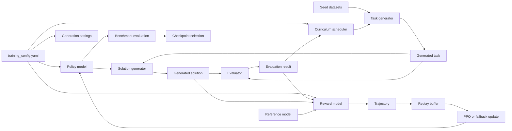

Read this diagram left to right.

The configuration controls model, reward, training, curriculum, generation, and evaluation settings.

The policy model is the trainable language model.

The curriculum scheduler chooses topic and difficulty.

The task generator creates a new task.

The solution generator asks the policy to solve the task.

The evaluator checks the solution.

The reward model computes a scalar reward.

The trajectory enters the replay buffer.

The trainer samples replay data and updates the policy.

The benchmark runner checks external performance.

The checkpoint logic preserves useful states.

---

## Training Loop Diagram

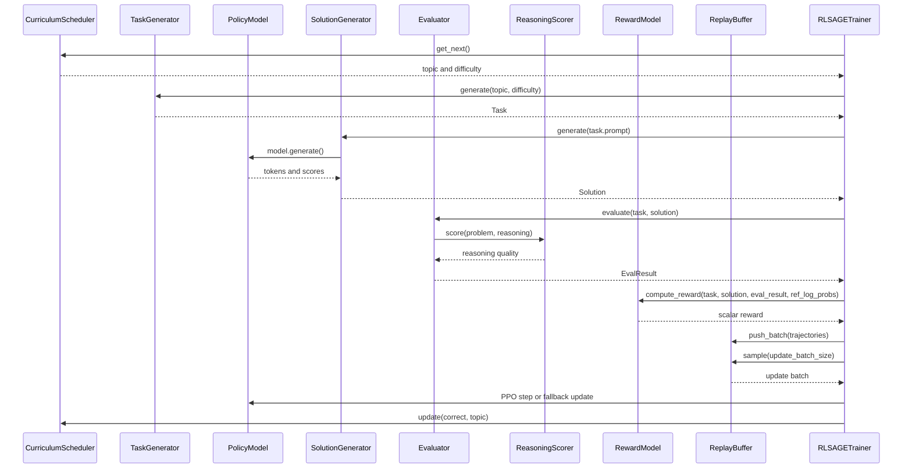

Each loop iteration contains rollout work and update work.

Rollout work generates fresh experience.

Update work improves the policy from stored experience.

The engine can collect multiple trajectories before one update.

The number of generated trajectories is controlled by `training.rollout_size`.

The number of trajectories sampled for update is controlled by `training.update_batch_size`.

---

## Runtime Data Flow

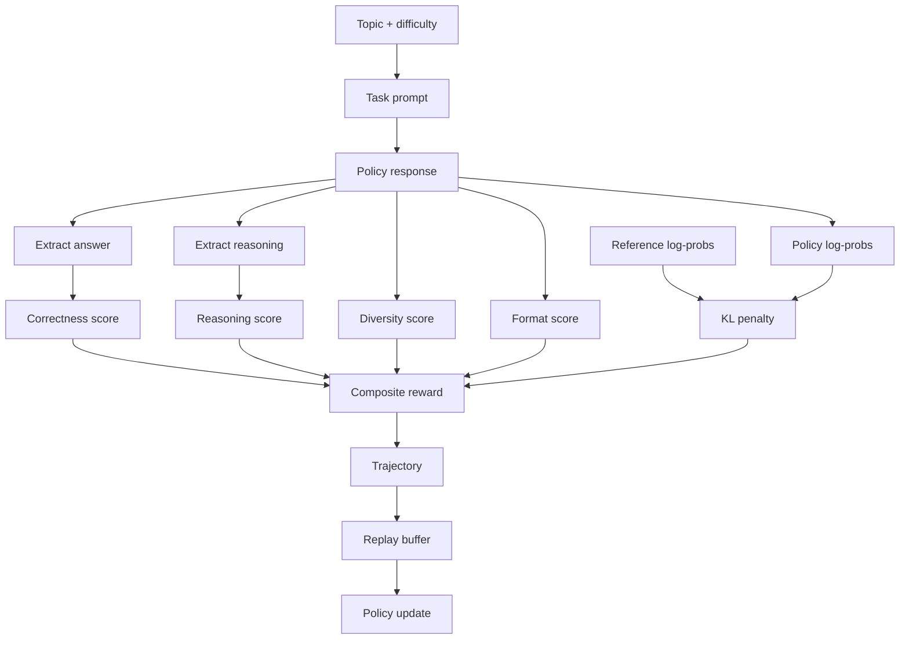

The response is used in several ways.

The answer is used for correctness.

The reasoning text is used for reasoning quality.

The raw response is used for diversity and format checks.

The generated token scores are used for training.

The reference model scores are used for KL regularization.

All of these signals become one reward value.

---

## Component Dependency Diagram

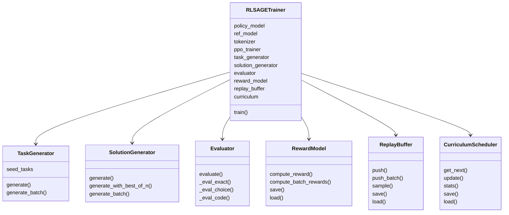

The trainer owns the runtime composition.

The generator modules do not train the model directly.

The evaluator does not update the curriculum directly.

The reward model does not store the trajectory directly.

The replay buffer does not decide task difficulty.

The curriculum does not compute reward.

This separation makes the code easier to modify.

---

## Quick Start

Use these commands from the project root.

The project root is the directory containing this README.

The commands assume Python is available as `python`.

On Windows, use PowerShell or a terminal that can run Python.

On Linux or macOS, the commands are the same except virtual environment activation differs.

### 1. Create A Virtual Environment

```bash
python -m venv .venv
```

### 2. Activate The Environment On Windows

```bash
.venv\Scripts\activate
```

### 3. Activate The Environment On Linux Or macOS

```bash
source .venv/bin/activate
```

### 4. Install Dependencies

```bash
pip install -r requirements.txt
```

### 5. Prepare Directories And Datasets

```bash
python scripts/setup.py
```

### 6. Run A Small Debug Training Pass

```bash
python scripts/train.py --config config/training_config.yaml --debug --no-wandb
```

### 7. Run The Main Training Configuration

```bash
python scripts/train.py --config config/training_config.yaml --no-wandb
```

### 8. Evaluate The Best Checkpoint

```bash
python scripts/evaluate.py --checkpoint checkpoints/best_model --all-benchmarks
```

### 9. Visualize Local Metric Curves

```bash
python scripts/visualize.py --log-dir logs/ --output-dir plots/
```

The debug command is the safest first run.

It switches to `distilgpt2`.

It disables quantization.

It disables LoRA.

It reduces total iterations.

It reduces sequence length.

It is useful for proving that imports, dataset loading, and the training loop work.

The full command uses the YAML configuration as written.

The full command may require CUDA and enough VRAM.

---

## Environment Requirements

The setup script checks Python version and CUDA availability.

The configured Python version in `pyrightconfig.json` is 3.10.

The setup script accepts Python 3.9 or newer.

Python 3.10 is a sensible target for this repository.

CUDA is strongly recommended.

CPU-only training is possible in principle but extremely slow.

The default model is too large for comfortable CPU experimentation.

For constrained hardware, use debug mode first.

For less than 7 GB VRAM, consider switching the base model to TinyLlama.

For full Phi-2 training, close other GPU-heavy applications before starting.

The requirements file includes PyTorch, Transformers, PEFT, TRL, Accelerate, Datasets, BitsAndBytes, and evaluation utilities.

BitsAndBytes is used for 4-bit loading and paged 8-bit optimization.

Some BitsAndBytes builds are platform-sensitive.

If BitsAndBytes is unavailable, the optimizer falls back to standard AdamW.

Standard AdamW uses more memory.

---

## Installation

Install dependencies after activating your virtual environment.

```bash
pip install -r requirements.txt
```

The requirements include:

- `torch` for tensor computation and model training.
- `transformers` for Hugging Face language models.
- `peft` for LoRA adapters.
- `trl` for PPO trainer support.
- `accelerate` for device placement helpers.
- `datasets` for GSM8K and ARC loading.
- `bitsandbytes` for quantization and memory-efficient optimizer support.
- `evaluate` for evaluation tooling.
- `rouge-score`, `nltk`, `scipy`, and `scikit-learn` for metrics and utilities.
- `wandb` and `tensorboard` for optional experiment tracking.
- `jsonlines`, `tqdm`, `pyyaml`, and `omegaconf` for runtime utilities.
- `rich` and `colorama` for developer-friendly terminal output.

If installation fails on `bitsandbytes`, verify your Python, CUDA, and platform compatibility.

If installation fails on PyTorch, install the PyTorch build that matches your CUDA runtime.

If dataset download fails, the training script may retry dataset loading later.

---

## Setup

Run setup after installing dependencies.

```bash
python scripts/setup.py
```

The setup script performs three practical checks.

It verifies Python version.

It checks whether PyTorch can see CUDA.

It creates expected local directories.

It also downloads GSM8K and ARC-Easy through Hugging Face Datasets.

The script prints whether CUDA is detected.

If CUDA is not detected, training will be very slow.

If VRAM is below roughly 6 GB, the script warns you.

That warning matters because the default configuration targets Phi-2.

TinyLlama or debug mode is usually better on very constrained machines.

---

## Debug Training

Debug mode is the first command to try when the project is unfamiliar.

```bash
python scripts/train.py --config config/training_config.yaml --debug --no-wandb
```

Debug mode changes the configuration in memory.

It does not rewrite `config/training_config.yaml`.

Debug mode uses `distilgpt2`.

Debug mode disables quantization.

Debug mode disables LoRA.

Debug mode disables gradient checkpointing.

Debug mode sets total iterations to 50.

Debug mode sets rollout size to 4.

Debug mode sets update batch size to 2.

Debug mode lowers maximum sequence length to 128.

Debug mode lowers maximum new tokens to 64.

Debug mode logs more frequently.

Debug mode evaluates at iteration 25.

Debug mode checkpoints at iteration 50.

Use debug mode to catch dependency errors.

Use debug mode to verify dataset access.

Use debug mode to verify the training loop.

Use debug mode to inspect output directories.

Do not treat debug metrics as meaningful research results.

---

## Full Training

The full training command uses the model and hyperparameters in the YAML file.

```bash
python scripts/train.py --config config/training_config.yaml --no-wandb
```

Remove `--no-wandb` if you want Weights & Biases tracking.

The default configuration uses `microsoft/phi-2`.

The default configuration enables 4-bit quantization.

The default configuration enables LoRA.

The default configuration enables gradient checkpointing.

The default training length is 5000 iterations.

The default rollout size is 32 trajectories per iteration.

The default update batch size is 16 trajectories.

The default sequence limit is 512 tokens.

The default response limit is 256 generated tokens.

The default optimizer is `paged_adamw_8bit`.

The default replay buffer capacity is 512 trajectories.

The default benchmark cadence is every 100 iterations.

The default checkpoint cadence is every 500 iterations.

Full training may take a long time.

Full training is sensitive to VRAM pressure.

Full training should be monitored for out-of-memory errors.

---

## Resume Training

Use `--resume` with a checkpoint directory.

```bash
python scripts/train.py --config config/training_config.yaml --resume checkpoints/iter_500 --no-wandb
```

The training script loads the base model first.

Then it loads the LoRA adapter from the checkpoint.

Then it tries to infer the start iteration from the directory name.

For `checkpoints/iter_500`, it resumes from iteration 501.

The trainer also restores transient engine state when matching state files exist.

The restored state includes curriculum state.

The restored state includes reward normalization state.

The restored state includes replay buffer contents.

The restored state includes trainer metadata such as best evaluation accuracy.

If the state directory is missing, training continues with fresh engine state.

This is useful when you only want to reuse adapter weights.

---

## Evaluate A Checkpoint

Run standalone evaluation with `scripts/evaluate.py`.

```bash
python scripts/evaluate.py --checkpoint checkpoints/best_model --all-benchmarks
```

You can choose specific benchmarks.

```bash
python scripts/evaluate.py --checkpoint checkpoints/best_model --benchmarks gsm8k arc_easy
```

You can control sample count.

```bash
python scripts/evaluate.py --checkpoint checkpoints/best_model --all-benchmarks --n-samples 100
```

You can save results as JSON.

```bash
python scripts/evaluate.py --checkpoint checkpoints/best_model --all-benchmarks --output results.json
```

Evaluation loads the base model from the YAML config.

Evaluation loads the LoRA checkpoint on top of the base model.

Evaluation runs greedy generation.

Evaluation computes benchmark accuracy.

GSM8K evaluation extracts numeric answers.

ARC evaluation extracts multiple-choice letters.

---

## Visualize Metrics

The visualization script reads local metric data or downloads a W&B run.

```bash
python scripts/visualize.py --log-dir logs/ --output-dir plots/
```

For W&B:

```bash
python scripts/visualize.py --wandb-run entity/project/run_id --output-dir plots/
```

The local visualization path produces `training_curves.png`.

The plot includes mean reward.

The plot includes task success rate.

The plot includes curriculum global success.

The plot includes benchmark accuracy when evaluation data is present.

The script requires `matplotlib`.

If `matplotlib` is missing, install it in the active environment.

---

## Configuration Overview

The main configuration file is:

```text
config/training_config.yaml
```

The file is organized into sections.

`model` controls base model loading, quantization, LoRA, and device placement.

`training` controls iteration count, rollout size, update size, sequence length, optimizer, and replay.

`ppo` controls PPO-specific hyperparameters.

`reward` controls reward component weights and normalization.

`generation` controls sampling behavior for generated tasks and solutions.

`curriculum` controls topic list, initial difficulty, adaptation thresholds, and window size.

`datasets` controls Hugging Face dataset names and benchmark-related dataset settings.

`evaluation` controls benchmark names and sample counts.

`logging` controls cadence, checkpoint directory, and optional external tracking.

`reasoning_scorer` controls the CPU reasoning scorer model.

The training script loads the YAML file once at startup.

Debug mode modifies the loaded dictionary in memory.

Debug mode does not persist those changes to disk.

---

## Model Configuration

The model section chooses the base language model.

The default is:

```yaml
model:
  base_model: "microsoft/phi-2"
```

The model section also controls quantization.

```yaml
quantization:
  enabled: true
  bits: 4
  quant_type: "nf4"
  double_quant: true
  compute_dtype: "float16"
```

`enabled: true` means load quantized weights.

`bits: 4` means use 4-bit base weights.

`quant_type: "nf4"` means use NormalFloat4 quantization.

`double_quant: true` quantizes quantization constants as well.

`compute_dtype: "float16"` uses fp16 compute.

The model section also controls LoRA.

```yaml
lora:
  enabled: true
  r: 16
  alpha: 32
  dropout: 0.05
  bias: "none"
  target_modules:
    - "q_proj"
    - "k_proj"
    - "v_proj"
    - "dense"
```

`r` is the adapter rank.

`alpha` is the LoRA scaling factor.

`dropout` regularizes adapter updates.

`bias: "none"` avoids training bias terms.

`target_modules` lists model submodules that receive LoRA adapters.

For Phi-2, the listed attention and dense projections are the intended targets.

If you change the base model, verify target module names.

Different model families use different projection names.

---

## Training Configuration

The training section controls the outer loop.

Important fields:

```yaml
training:
  total_iterations: 5000
  rollout_size: 32
  update_batch_size: 16
  gradient_accumulation_steps: 8
  ppo_epochs: 4
  max_seq_length: 512
  max_new_tokens: 256
```

`total_iterations` is the number of trainer iterations.

`rollout_size` is how many trajectories are collected per iteration.

`update_batch_size` is how many trajectories are sampled for each update.

`gradient_accumulation_steps` trades memory for effective batch size.

`ppo_epochs` controls how many PPO epochs are requested.

`max_seq_length` caps prompt plus response length for model calls.

`max_new_tokens` caps generated response length.

Optimizer fields:

```yaml
learning_rate: 1.0e-5
weight_decay: 0.01
warmup_steps: 100
optimizer: "paged_adamw_8bit"
```

The current optimizer builder reads learning rate and weight decay.

It attempts to use BitsAndBytes `PagedAdamW8bit`.

It falls back to PyTorch `AdamW` if BitsAndBytes is unavailable.

Replay fields:

```yaml
replay_buffer_capacity: 512
replay_buffer_alpha: 0.6
```

`replay_buffer_capacity` controls stored trajectories.

`replay_buffer_alpha` controls prioritized sampling sharpness.

Higher alpha gives more weight to high-absolute-reward trajectories.

---

## PPO Configuration

The PPO section stores reinforcement learning hyperparameters.

```yaml
ppo:
  epsilon: 0.2
  value_coeff: 0.5
  entropy_coeff: 0.01
  kl_penalty: 0.1
  lam: 0.95
  gamma: 1.0
  vf_clip: 0.2
  max_grad_norm: 0.5
```

The wrapper currently passes a subset into TRL `PPOConfig`.

The fallback update uses `max_grad_norm`.

`epsilon` is the intended PPO clipping range.

`value_coeff` is the intended value loss weight.

`entropy_coeff` is the intended entropy bonus weight.

`kl_penalty` is the intended KL regularization strength.

`lam` is the GAE lambda value.

`gamma` is the discount factor.

`vf_clip` is the intended value-function clipping range.

`max_grad_norm` prevents extreme gradient updates.

Because TRL APIs change across versions, the trainer checks for `PPOTrainer.step()`.

When that method exists, it uses the TRL PPO step.

When that method does not exist, it uses the fallback update path.

---

## Reward Configuration

The reward section defines how training feedback is composed.

```yaml
reward:
  alpha_correctness: 0.70
  alpha_reasoning: 0.20
  alpha_diversity: 0.05
  difficulty_bonus: 0.30
  wrong_answer_penalty: -0.5
  max_reward_clip: 1.5
  normalize_rewards: true
```

`alpha_correctness` weights answer correctness.

`alpha_reasoning` weights reasoning quality.

`alpha_diversity` rewards non-repetitive outputs.

`difficulty_bonus` gives harder tasks larger reward scale.

`wrong_answer_penalty` penalizes incorrect answers.

`max_reward_clip` bounds extreme rewards.

`normalize_rewards` enables online normalization.

The code also supports `alpha_format`.

If `alpha_format` is absent, it defaults to 0.05 inside `RewardModel`.

The reward model uses online Welford statistics for mean and variance.

That keeps reward normalization stable across long runs.

---

## Generation Configuration

The generation section controls sampling behavior.

```yaml
generation:
  temperature: 0.7
  top_p: 0.95
  repetition_penalty: 1.2
  do_sample: true
```

`temperature` controls randomness.

Higher temperature creates more diverse outputs.

Lower temperature creates more deterministic outputs.

`top_p` uses nucleus sampling.

`repetition_penalty` discourages repeated text.

`do_sample` indicates sampling instead of greedy decoding.

The solution generator clamps retry temperatures between 0.1 and 2.0.

Retries occur when answer extraction fails.

The task generator uses task-generation sampling separately.

Benchmark evaluation uses greedy decoding.

---

## Curriculum Configuration

The curriculum section controls task distribution.

```yaml
curriculum:
  initial_difficulty: 0.2
  difficulty_step: 0.05
  success_threshold_up: 0.75
  success_threshold_down: 0.40
  window_size: 50
  topics:
    - "arithmetic"
    - "algebra"
    - "word_problems"
    - "geometry"
    - "commonsense"
    - "logic"
    - "science"
```

`initial_difficulty` sets the starting difficulty.

`difficulty_step` controls adaptation size.

`success_threshold_up` increases difficulty when success is high.

`success_threshold_down` decreases difficulty when success is low.

`window_size` controls adaptation cadence and recent success window behavior.

`topics` lists categories that can be sampled.

The code also supports warmup iterations.

The default warmup inside the scheduler is 500 if absent from the YAML.

The code also supports a mastery gate threshold.

The default mastery gate threshold is 0.80 if absent from the YAML.

---

## Dataset Configuration

The dataset section defines external datasets.

```yaml
datasets:
  gsm8k:
    path: "openai/gsm8k"
    split: "main"
    seed_examples: 50
  arc:
    path: "allenai/ai2_arc"
    config: "ARC-Easy"
  humaneval:
    path: "openai_humaneval"
    enabled: false
```

GSM8K is used to seed task generation.

The task generator reads GSM8K training examples.

The seed examples help the model create similar but new problems.

ARC is used for benchmark evaluation.

HumanEval is disabled by default.

The evaluator has code-task support, but code reasoning is not the default path.

---

## Evaluation Configuration

The evaluation section controls periodic benchmark checks.

```yaml
evaluation:
  benchmarks:
    - name: "gsm8k"
      n_samples: 200
      decode: "greedy"
    - name: "arc_easy"
      n_samples: 200
      decode: "greedy"
    - name: "arc_challenge"
      n_samples: 100
      decode: "greedy"
  holdout_tasks: 50
```

The trainer calls benchmark evaluation every `logging.eval_every` iterations.

The evaluation function returns a dictionary of benchmark accuracies.

The trainer averages benchmark accuracies into a mean accuracy.

If mean accuracy improves, the trainer saves `checkpoints/best_model`.

The standalone evaluation script can run benchmarks after training.

The `decode` field is present in configuration.

The current benchmark helper uses greedy generation for evaluation.

---

## Reasoning Scorer Configuration

The reasoning scorer runs on CPU by default.

```yaml
reasoning_scorer:
  model: "cross-encoder/nli-deberta-v3-small"
  device: "cpu"
  batch_size: 8
```

The reasoning scorer is loaded outside debug mode.

It uses a cross-encoder NLI model.

It compares the problem and reasoning text.

It estimates whether reasoning is entailed, neutral, or contradictory.

The score is mapped to a value between 0 and 1.

The evaluator inserts that score into `EvalResult.reasoning_quality`.

The reward model maps reasoning quality into a reward component.

---

## Main Runtime Objects

The main training script creates the runtime objects in this order.

1. Load configuration.

2. Apply debug overrides if requested.

3. Initialize optional W&B tracking.

4. Load the policy model and tokenizer.

5. Load LoRA checkpoint if `--resume` is provided.

6. Load the reference model or shared reference view.

7. Load the CPU reasoning scorer when not in debug mode.

8. Load GSM8K seed tasks.

9. Build the task generator.

10. Build the solution generator.

11. Build the evaluator.

12. Build the reward model.

13. Build the replay buffer.

14. Build the curriculum scheduler.

15. Build the optimizer.

16. Build the PPO trainer wrapper.

17. Build `RLSAGETrainer`.

18. Call `trainer.train()`.

This order matters.

The reference model can share policy base weights only after the policy exists.

The task generator needs the policy model and tokenizer for task generation.

The solution generator needs the trainable policy.

The evaluator optionally needs the reasoning scorer.

The trainer needs all modules.

---

## Task Generator

File:

```text
src/modules/task_generator.py
```

Primary dataclass:

```text
Task
```

Primary class:

```text
TaskGenerator
```

The task generator creates new practice tasks.

It is seeded with examples from a dataset.

For this project, the seed source is GSM8K.

The generator receives a topic.

The generator receives a difficulty.

It samples a few seed examples for variety.

It builds a prompt that asks the model to create one new problem.

It expects the generated task to contain `PROBLEM`, `SOLUTION`, and `ANSWER` fields.

It parses the generated text.

It converts the parsed problem into a solve prompt.

It returns a `Task` object.

The `Task` object contains `task_id`.

The `Task` object contains `prompt`.

The `Task` object contains `problem`.

The `Task` object contains `reference_answer`.

The `Task` object contains `difficulty`.

The `Task` object contains `topic`.

The `Task` object contains `source`.

The `Task` object contains optional metadata.

If parsing fails, the generator uses a fallback.

The fallback treats the raw generated text as the problem.

The fallback sets the answer to `UNKNOWN`.

That fallback keeps the loop from crashing.

It can also produce weak training data.

For better results, task format quality matters.

---

## Solution Generator

File:

```text
src/modules/solution_generator.py
```

Primary dataclass:

```text
Solution
```

Primary class:

```text
SolutionGenerator
```

The solution generator asks the policy to solve a task.

It wraps prompts in a structured reasoning format.

The wrapper asks for reasoning inside `<reasoning>` tags.

The wrapper asks for a final `ANSWER:` line.

The generator calls `model.generate()`.

It requests token scores from generation.

It computes per-token log-probabilities for generated tokens.

It decodes generated text.

It extracts reasoning.

It extracts the final answer.

It stores all of that in a `Solution` object.

The `Solution` object contains full text.

The `Solution` object contains extracted reasoning.

The `Solution` object contains extracted answer.

The `Solution` object contains token log-probabilities.

The `Solution` object contains generated token count.

The `Solution` object contains retry count.

The `Solution` object contains metadata.

If answer extraction fails, the answer is `UNPARSED`.

The generator can retry after parse failure.

Each retry increases temperature slightly.

The goal is to recover parseable answers without failing the whole iteration.

The class also supports `generate_with_best_of_n`.

That method samples multiple candidates and returns the highest-scoring candidate.

The current trainer uses the normal `generate` path.

---

## Evaluator

File:

```text
src/modules/evaluator.py
```

Primary dataclass:

```text
EvalResult
```

Primary class:

```text
Evaluator
```

The evaluator decides whether a solution is correct.

It chooses an evaluation mode.

It supports exact or numeric matching.

It supports multiple-choice matching.

It supports Python code execution for code tasks.

It can also include reasoning quality from the reasoning scorer.

The evaluator detects code tasks from topic or task source.

It detects multiple-choice tasks by looking for options like `(A)`, `(B)`, `(C)`, and `(D)`.

Everything else uses exact or numeric matching.

For exact matching, it normalizes text.

Normalization lowercases the answer.

Normalization strips punctuation.

Normalization collapses whitespace.

Numeric matching tries to compare float values with a small tolerance.

For multiple choice, it extracts A, B, C, or D.

For code, it executes generated Python plus test code in a subprocess.

The code path has a timeout.

The code path returns failure on timeout.

The evaluator returns an `EvalResult`.

`EvalResult.correct` is a boolean.

`EvalResult.correctness_score` is numeric.

`EvalResult.reasoning_quality` is numeric.

`EvalResult.eval_mode` identifies the mode.

`EvalResult.details` stores extra information.

---

## Reasoning Scorer

File:

```text
src/models/reasoning_scorer.py
```

Primary class:

```text
ReasoningScorer
```

The reasoning scorer estimates coherence of the reasoning text.

It uses `cross-encoder/nli-deberta-v3-small` by default.

The model is loaded on CPU by default.

The scorer compares problem text and reasoning text.

It produces an NLI distribution.

The NLI distribution contains contradiction probability.

The NLI distribution contains neutral probability.

The NLI distribution contains entailment probability.

The score rewards entailment.

The score penalizes contradiction.

The score is clipped to the range 0 to 1.

Empty reasoning receives a low score.

The reasoning scorer is an auxiliary signal.

It is not the same as proof verification.

It can be wrong.

It can be fooled.

It is still useful as a soft reward component.

---

## Reward Model

File:

```text
src/modules/reward_model.py
```

Primary classes:

```text
WelfordStats
RewardModel
```

The reward model converts evaluation into a scalar.

The reward is the number used for reinforcement learning.

The current reward combines several components.

Correctness is the most important component.

Reasoning quality is a secondary component.

Diversity discourages repeated solution text.

Format rewards structured reasoning and answer lines.

KL penalty discourages drifting too far from the reference model.

Difficulty scales the total reward.

The reward is clipped.

The reward can be normalized online.

The core reward shape is:

```text
raw_reward =
  alpha_correctness * correctness_reward
+ alpha_reasoning   * reasoning_reward
+ alpha_diversity   * diversity_reward
+ alpha_format      * format_reward
+ kl_penalty
```

Then the code applies difficulty scaling:

```text
raw_reward = raw_reward * (1 + difficulty_bonus * task_difficulty)
```

If normalization is enabled, Welford statistics normalize the value.

Finally the reward is clipped:

```text
reward = clip(raw_reward, -max_reward_clip, +max_reward_clip)
```

Correct answers receive positive correctness reward.

Incorrect answers receive a penalty unless the issue is parse failure or similar.

The wrong answer penalty scales with difficulty.

Harder wrong answers are penalized more.

The reasoning reward maps a 0 to 1 reasoning score into -1 to +1.

The diversity reward uses recent solution history.

High similarity to recent outputs gives lower diversity reward.

The format reward looks for reasoning tags.

The format reward looks for an `ANSWER:` line.

The format reward looks for at least three reasoning steps.

The KL penalty compares policy and reference token log-probabilities.

If reference log-probabilities are unavailable, KL penalty is zero.

---

## Replay Buffer

File:

```text
src/modules/replay_buffer.py
```

Primary dataclass:

```text
Trajectory
```

Primary class:

```text
ReplayBuffer
```

The replay buffer stores completed trajectories.

It is CPU-resident.

It uses a fixed capacity.

When capacity is exceeded, old entries are discarded.

The default capacity is 512.

Each trajectory stores task ID.

Each trajectory stores query text.

Each trajectory stores response text.

Each trajectory stores reward.

Each trajectory stores policy log-probabilities when available.

Each trajectory stores reference log-probabilities when available.

Each trajectory stores correctness.

Each trajectory stores difficulty.

Each trajectory stores topic.

Each trajectory stores iteration number.

Each trajectory stores whether it is hindsight relabeled.

Each trajectory stores metadata.

The buffer supports uniform sampling.

The buffer supports recent sampling.

The buffer supports prioritized sampling.

The buffer supports stratified sampling.

The trainer uses stratified sampling.

Stratified sampling tries to include each topic.

Then it fills the rest of the batch using prioritized sampling.

Prioritized sampling weights entries by absolute reward.

That gives strong successes and strong failures more chance to influence updates.

The buffer can save to JSON.

The buffer can load from JSON.

Saved replay entries omit large tensors.

That is intentional.

Stored token log-probabilities are specific to the model state that generated them.

After loading from disk, replay examples can still be useful as text trajectories.

They are not exact old PPO trajectories.

---

## Curriculum Scheduler

File:

```text
src/modules/curriculum.py
```

Primary classes:

```text
DifficultyRecord
CurriculumScheduler
```

The curriculum scheduler chooses topic and difficulty for the next task.

It keeps independent difficulty values per topic.

It keeps recent success windows.

It supports a warmup phase.

It supports adaptive difficulty.

It supports a mastery gate.

It samples topics based on inverse success rate.

Topics the model struggles with become more likely.

Topics the model already solves become less dominant.

During warmup, difficulty rises smoothly.

The warmup uses a cosine ramp.

After warmup, difficulty adapts per topic.

If success is above the upward threshold, difficulty increases.

If success is below the downward threshold, difficulty decreases.

If success is in the middle, difficulty stays stable.

The scheduler adds small Gaussian jitter to difficulty.

Jitter prevents every prompt from being conditioned on exactly the same number.

The scheduler has named difficulty bands.

The bands are very_easy, easy, medium, hard, and very_hard.

The scheduler can save state.

The scheduler can load state.

Saving state matters because curriculum progress is part of training.

---

## Curriculum State Diagram

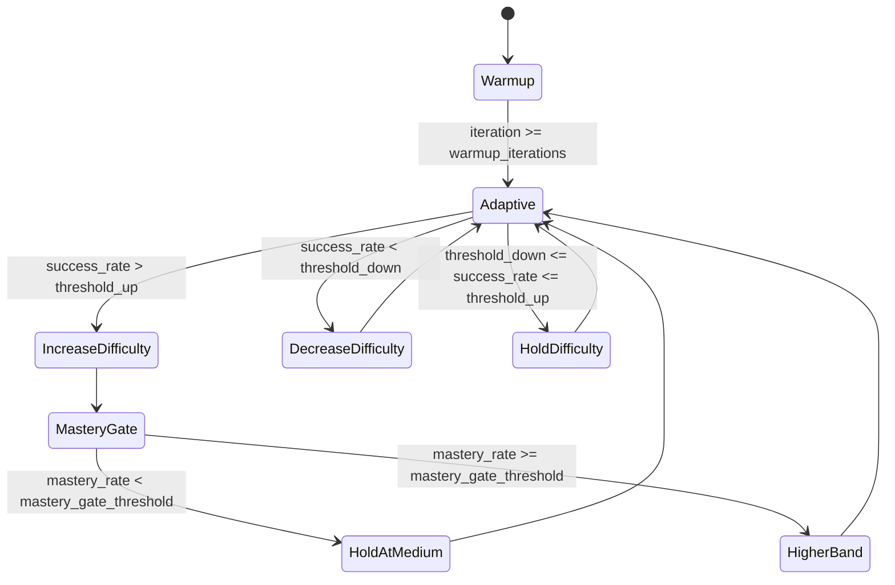

The warmup phase avoids starting too hard.

The adaptive phase keeps tasks near the model learning frontier.

The mastery gate prevents premature jumps into harder bands.

The inverse-success topic sampling avoids overtraining already mastered topics.

---

## Policy Model

File:

```text
src/models/policy.py
```

Primary functions:

```text
load_policy_model()
load_reference_model()
get_log_probs()
```

The policy model is the trainable language model.

The default policy base is Phi-2.

The loader checks VRAM before loading.

It warns when no CUDA device is detected.

It can load 4-bit quantized weights.

It prepares the model for k-bit training.

It applies LoRA adapters when enabled.

It enables gradient checkpointing when configured.

It loads the tokenizer.

It sets the tokenizer pad token when needed.

It sets left padding.

Left padding is useful for causal language models in batched generation and PPO-style workflows.

The policy loader reports VRAM usage.

The loader uses `trust_remote_code=True`.

That is required for Phi-2.

Only trainable LoRA parameters should receive gradients in the default setup.

The frozen base model carries most of the knowledge.

The adapters learn the task-specific behavior shift.

---

## Reference Model

The reference model is used for KL regularization.

KL regularization compares the current policy to a reference policy.

If the current policy drifts too far, reward is penalized.

The code prefers weight sharing when possible.

When the policy is a PEFT model, the reference can reuse the base weights.

This saves memory.

If weight sharing is not possible, the code can load an independent reference model.

Independent reference models use more VRAM.

The reference model does not train.

The reference model produces token log-probabilities.

Those log-probabilities are compared to policy token log-probabilities.

The comparison is used by the reward model.

This helps prevent reward hacking and catastrophic drift.

---

## PPO Trainer Wrapper

File:

```text
src/training/ppo_trainer.py
```

Primary functions:

```text
build_ppo_config()
build_ppo_trainer()
build_optimizer()
```

The wrapper translates the YAML dictionary into TRL objects.

It builds `PPOConfig`.

It builds a TRL `PPOTrainer`.

It creates a dummy dataset because newer TRL versions require a training dataset.

It passes tokenizer as the processing class.

It passes optimizer when available.

It builds a memory-efficient optimizer when BitsAndBytes is installed.

The optimizer is `PagedAdamW8bit` when available.

The fallback optimizer is PyTorch `AdamW`.

The project handles TRL version differences.

Some TRL versions expose `PPOTrainer.step()`.

Some TRL versions do not expose that method.

The main trainer checks for the method at runtime.

---

## Main Trainer

File:

```text
src/training/train_loop.py
```

Primary classes:

```text
EarlyStopper
RLSAGETrainer
```

The main trainer orchestrates the engine.

It owns all modules.

It controls iteration count.

It controls rollout collection.

It controls update cadence.

It controls benchmark evaluation.

It controls checkpoint saving.

It controls state restoration.

The trainer loop does the following:

1. Check VRAM.

2. Collect rollout trajectories.

3. Perform a PPO or fallback update if the buffer has enough data.

4. Update curriculum from trajectory correctness.

5. Record metrics at configured cadence.

6. Run benchmark evaluation at configured cadence.

7. Save best checkpoint when evaluation improves.

8. Stop early if evaluation fails to improve for enough rounds.

9. Save periodic checkpoints.

10. Save a final checkpoint.

The trainer catches rollout errors.

Failed rollout items are skipped.

That keeps one bad generated task from ending training.

The trainer stores local metric records.

The trainer optionally sends metrics to W&B.

The trainer saves LoRA adapters and tokenizer files.

The trainer also saves engine state.

Engine state includes curriculum, reward statistics, replay buffer, and trainer metadata.

---

## Theoretical Knowledge

This section explains the concepts behind RL-SAGE.

The goal is not to prove every theorem.

The goal is to make the implementation understandable.

RL-SAGE combines ideas from language modeling, reinforcement learning, curriculum learning, reward shaping, and parameter-efficient fine-tuning.

Each concept maps to a file in this repository.

Policy modeling maps to `src/models/policy.py`.

Task generation maps to `src/modules/task_generator.py`.

Solution generation maps to `src/modules/solution_generator.py`.

Evaluation maps to `src/modules/evaluator.py`.

Reward shaping maps to `src/modules/reward_model.py`.

Experience replay maps to `src/modules/replay_buffer.py`.

Curriculum learning maps to `src/modules/curriculum.py`.

Optimization maps to `src/training/ppo_trainer.py` and `src/training/train_loop.py`.

Benchmarking maps to `src/evaluation/benchmarks.py`.

Metrics map to `src/evaluation/metrics.py`.

---

## Language Models As Policies

In reinforcement learning, a policy chooses actions.

For a language model, the policy chooses tokens.

The state is the prompt and all previously generated tokens.

The action at each step is the next token.

The policy distribution is a probability distribution over the vocabulary.

The notation is:

```text
pi_theta(token_t | prompt, token_1, ..., token_{t-1})
```

`theta` represents trainable parameters.

In RL-SAGE, most base model parameters are frozen.

The trainable parameters are usually LoRA adapter weights.

The policy generates a full solution token by token.

The generated full solution is treated as the action sequence.

The reward is assigned after the solution is evaluated.

This is a sparse reward setting.

Most tokens do not receive direct labels.

The full sequence receives a scalar outcome.

PPO and policy-gradient methods use that outcome to shift token probabilities.

---

## Tasks As Environments

In classic RL, the environment receives actions and returns observations and rewards.

In RL-SAGE, the environment is simpler.

The environment is a generated task plus evaluator.

The task provides the prompt.

The policy produces a solution.

The evaluator scores the solution.

The reward model turns scores into a scalar reward.

There is no multi-turn environment state in the current implementation.

The episode is one generated solution.

The episode starts with a problem prompt.

The episode ends after the model response.

This makes the setup closer to contextual bandit learning than long-horizon control.

However, token generation still has sequential structure.

Each token depends on previous tokens.

The reward is delayed until the end.

That delayed reward is why log-probabilities matter.

The optimizer needs to know which token decisions produced the final outcome.

---

## Trajectories

A trajectory is a record of one model attempt.

In RL-SAGE, a trajectory includes:

- Query.
- Response.
- Reward.
- Correctness.
- Topic.
- Difficulty.
- Iteration.
- Policy token log-probabilities.
- Reference token log-probabilities.
- Metadata.

The mathematical form is:

```text
tau = (query, response, reward, metadata)
```

The response is itself a sequence.

```text
response = (token_1, token_2, ..., token_T)
```

The probability of the response under the policy is:

```text
pi_theta(response | query) = product_t pi_theta(token_t | query, token_<t)
```

For numerical stability, the code works with log-probabilities.

```text
log pi_theta(response | query) = sum_t log pi_theta(token_t | query, token_<t)
```

The solution generator captures generated token log-probabilities.

The policy utility can recompute log-probabilities for prompt-response pairs.

---

## Rewards

Reward is the scalar training signal.

Good reward design is critical.

If reward is too sparse, learning is slow.

If reward is too noisy, learning is unstable.

If reward is misaligned, the model learns the wrong behavior.

If reward is too easy to exploit, the model reward-hacks.

RL-SAGE uses composite reward shaping.

The largest term is correctness.

The reasoning term encourages coherent step-by-step explanations.

The diversity term discourages repeating one solution template.

The format term encourages parseable outputs.

The KL term discourages drifting away from the reference policy.

The difficulty scale rewards harder successes more.

The final reward is normalized and clipped.

Normalization keeps reward scale manageable.

Clipping prevents extreme single examples from dominating updates.

---

## Policy Gradient

Policy-gradient learning optimizes expected reward.

The objective can be written as:

```text
J(theta) = E_tau~pi_theta [ R(tau) ]
```

The policy-gradient idea is:

```text
grad_theta J(theta) = E[ grad_theta log pi_theta(response | query) * R(tau) ]
```

This means a high-reward response increases probability of its token choices.

A low-reward response decreases probability of its token choices.

In practice, raw rewards are usually centered or transformed.

That reduces variance.

The fallback update in this repository normalizes rewards inside the batch.

It then computes a reward-weighted log-probability loss.

That fallback is simpler than full PPO.

It is useful when the installed TRL PPO API does not expose the expected step method.

---

## Advantages

An advantage estimates how much better an action was than expected.

The common form is:

```text
advantage = return - baseline
```

The baseline is often a value function.

A positive advantage means the action was better than expected.

A negative advantage means the action was worse than expected.

Advantages reduce policy-gradient variance.

PPO normally uses advantage estimates.

The YAML config includes `lam`, which relates to Generalized Advantage Estimation.

GAE balances bias and variance.

For one-step or episode-level reward tasks, advantage logic can be simpler than long-horizon RL.

The current fallback update uses normalized rewards as a rough advantage substitute.

That is less sophisticated than PPO.

It still provides a practical learning signal.

---

## PPO

PPO stands for Proximal Policy Optimization.

PPO is popular because it limits update size.

Large policy updates can destroy language model behavior.

PPO compares the new policy to the old policy.

It forms a probability ratio:

```text
ratio(theta) =
  pi_theta(action | state) / pi_theta_old(action | state)
```

The clipped PPO objective is:

```text
L_clip(theta) =
  E[ min(ratio * advantage,
         clip(ratio, 1 - epsilon, 1 + epsilon) * advantage) ]
```

The clip prevents the ratio from moving too far.

If an update would make a token much more likely, the clip limits the objective.

If an update would make a token much less likely, the clip also limits the objective.

This gives PPO its practical stability.

For language models, PPO is often used after supervised fine-tuning.

In RL-SAGE, PPO is used to update LoRA policy adapters from generated reward signals.

---

## PPO Update Diagram

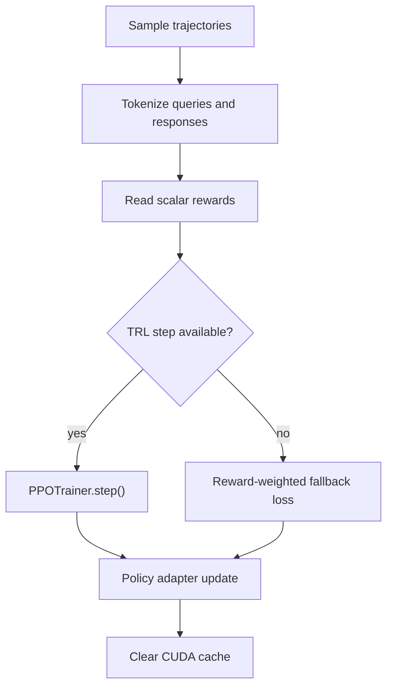

The trainer checks the installed TRL object.

If `step` exists, the trainer attempts TRL PPO.

If `step` fails or does not exist, the fallback path is used.

The fallback path computes current-policy response log-probabilities with gradients enabled.

It multiplies the mean log-probability by normalized reward.

It backpropagates through the LoRA parameters.

It clips gradients.

It steps the optimizer.

---

## KL Regularization

KL divergence measures how different two probability distributions are.

For policy training, KL can compare current policy and reference policy.

The conceptual form is:

```text
KL(pi_theta || pi_ref)
```

The reward includes a negative KL term:

```text
reward_total = reward_task - beta * KL(pi_theta || pi_ref)
```

`beta` controls penalty strength.

Higher beta keeps the policy closer to the reference.

Lower beta allows more drift.

Too much drift can damage language quality.

Too little drift can prevent learning.

The reference policy is useful because the base model already has general language ability.

The goal is not to replace that ability.

The goal is to nudge behavior toward better reasoning on the target task distribution.

---

## Reward Shaping

Reward shaping adds intermediate signals.

Pure correctness reward is sparse.

A model may produce nearly correct reasoning but miss the final arithmetic.

A model may produce the correct answer with unparseable format.

A model may repeat the same pattern too often.

Reward shaping gives partial guidance.

In RL-SAGE, correctness still dominates.

Reasoning, format, diversity, and KL terms shape behavior around correctness.

Good shaping should preserve the true goal.

Bad shaping can optimize the wrong behavior.

For example, too much format reward could make the model write pretty but wrong answers.

Too much diversity reward could make the model avoid useful standard solution methods.

Too much reasoning reward could reward plausible but incorrect chains.

Reward weights should be inspected and tuned.

---

## Curriculum Learning

Curriculum learning controls example difficulty over time.

Humans often learn better from problems that are neither trivial nor impossible.

The same idea can help model training.

If tasks are too easy, reward saturates.

If tasks are too hard, reward becomes mostly noise.

The best region is the learning frontier.

The learning frontier is where the model sometimes succeeds and sometimes fails.

RL-SAGE uses recent success rate to approximate this frontier.

High success means increase difficulty.

Low success means decrease difficulty.

Moderate success means hold difficulty.

The scheduler tracks topics separately.

That matters because a model may be good at arithmetic but weak at geometry.

One global difficulty value would hide that difference.

Per-topic difficulty gives finer control.

---

## Experience Replay

Experience replay stores previous trajectories.

Without replay, each generated trajectory might be used once.

Replay improves sample efficiency.

Replay allows batching across topics.

Replay allows prioritization.

Replay also introduces off-policy concerns.

Old trajectories were generated by older policy versions.

The farther the policy moves, the less exact old log-probabilities become.

RL-SAGE keeps replay small.

It also stores text trajectories without huge tensors when saving to disk.

For lightweight experimentation, this is a practical compromise.

For rigorous PPO research, off-policy handling deserves extra care.

---

## Hindsight Relabeling

Hindsight relabeling creates synthetic training examples from failed attempts.

In this repository, the replay buffer checks wrong trajectories with positive reward.

Such a trajectory may have good reasoning and format but a wrong final answer.

If ground truth is available, the buffer can replace the final `ANSWER:` line.

The synthetic copy receives partial positive reward.

The synthetic copy is marked as hindsight.

This can teach the model that the reasoning structure was useful while correcting the final answer.

This is a heuristic.

It can help when small arithmetic mistakes hide otherwise useful reasoning.

It can hurt if the reasoning was actually invalid.

The reward threshold limits when relabeling happens.

Only wrong trajectories with reward above 0.3 are considered.

---

## QLoRA

QLoRA combines quantized base models with LoRA adapter training.

The base model weights are loaded in low precision.

The adapter weights remain trainable.

This reduces memory use.

The model can still learn task-specific behavior through adapters.

QLoRA is especially useful for limited VRAM experiments.

In RL-SAGE, QLoRA is the reason Phi-2 can be attempted on constrained hardware.

The base model is not fully fine-tuned.

The adapter is fine-tuned.

The saved checkpoint is adapter-centric.

This makes checkpoints smaller than full model checkpoints.

---

## LoRA

LoRA stands for Low-Rank Adaptation.

Instead of training a full weight matrix, LoRA trains low-rank update matrices.

The idea is:

```text
W_updated = W_base + scale * B * A
```

`W_base` is frozen.

`A` and `B` are trainable low-rank matrices.

The rank is controlled by `r`.

The scale is related to `alpha / r`.

Low rank means fewer trainable parameters.

Fewer trainable parameters means lower memory use.

Fewer trainable parameters also reduces checkpoint size.

LoRA is not free.

Too low a rank can limit capacity.

Too high a rank increases memory use.

The default rank is 16.

The default alpha is 32.

---

## 4-Bit Quantization

Quantization stores model weights with fewer bits.

Full fp16 uses 16 bits per weight.

4-bit quantization uses roughly 4 bits per weight.

That reduces memory dramatically.

The default quantization type is NF4.

NF4 stands for NormalFloat4.

NF4 is designed for normally distributed neural network weights.

Double quantization compresses quantization metadata.

The compute dtype remains fp16 by default.

The model still performs forward and backward operations with higher precision than storage precision.

Quantization can slightly reduce quality.

The memory savings often justify it for adapter training.

---

## Reasoning Quality Scoring

Correctness alone can miss useful differences.

Two wrong answers can be very different.

One may be nonsense.

One may have coherent reasoning but a final arithmetic slip.

The reasoning scorer tries to distinguish those cases.

It uses NLI as a proxy.

The problem is treated as a premise.

The reasoning is treated as a hypothesis.

If the reasoning is entailed or supported, the score increases.

If the reasoning contradicts the problem, the score decreases.

This is not a formal proof checker.

It is a learned heuristic.

It should be weighted below correctness.

The default configuration does exactly that.

---

## Evaluation Theory

Evaluation is different from training reward.

Training reward can include shaping terms.

Benchmark evaluation should measure task success directly.

For GSM8K, the key measure is numeric answer accuracy.

For ARC, the key measure is multiple-choice accuracy.

During evaluation, generation is greedy.

Greedy evaluation reduces randomness.

This makes benchmark results easier to compare across checkpoints.

However, greedy evaluation does not measure all possible sampling behavior.

If you deploy with sampling, evaluate with deployment-like decoding too.

The repository focuses on standard benchmark accuracy.

The metrics module also contains utility functions for diversity, reward statistics, per-topic accuracy, self-improvement rate, and generalization gap.

---

## Generalization

Generalization means the model improves beyond memorized training examples.

RL-SAGE trains on generated tasks.

Generated tasks can be diverse.

Generated tasks can also be flawed or repetitive.

External benchmarks help check generalization.

If training reward rises but benchmark accuracy does not, the model may be overfitting the generated task style.

If generated task success rises but ARC or GSM8K does not, curriculum or reward may be too narrow.

If benchmark accuracy rises but training reward is noisy, reward normalization and task validity may need inspection.

The generalization gap concept compares in-distribution performance with holdout performance.

Smaller gap is better.

The metrics module includes `compute_generalization_gap`.

---

## Reward Hacking

Reward hacking happens when the model exploits the reward without solving the real task.

Examples can include:

- Always writing an `ANSWER:` line for format reward.
- Repeating high-scoring reasoning templates.
- Producing verbose reasoning that fools the reasoning scorer.
- Exploiting weak answer parsing.
- Generating tasks with easy or malformed answers.

RL-SAGE uses several defenses.

Correctness has the largest reward weight.

KL penalty discourages extreme drift.

Diversity reward discourages identical outputs.

Reward clipping limits extreme signals.

Benchmark evaluation checks external task performance.

Curriculum adaptation prevents staying on only easy tasks.

These defenses are not perfect.

Always inspect generated tasks and generated solutions during serious experiments.

---

## Stability

Language model RL can be unstable.

Small reward bugs can create large behavior changes.

Large learning rates can damage generation quality.

Long sequences can exceed memory.

Too much sampling randomness can increase reward noise.

Too little sampling randomness can reduce exploration.

Too much KL penalty can block learning.

Too little KL penalty can allow drift.

Too much difficulty can make rewards sparse.

Too little difficulty can make rewards uninformative.

PPO clipping helps stability.

Gradient clipping helps stability.

Reward clipping helps stability.

Reward normalization helps stability.

Curriculum scheduling helps stability.

Checkpointing helps recovery.

Debug mode helps isolate environment problems.

---

## One Iteration In Detail

This section walks through one trainer iteration.

Step 1: VRAM is checked.

The trainer calls `_check_vram`.

If CUDA memory allocation is high, a warning is emitted.

Step 2: rollout collection begins.

The policy is switched to evaluation mode.

Step 3: the curriculum returns a topic and difficulty.

The scheduler may be in warmup or adaptive phase.

Step 4: the task generator creates a task.

The task includes a solve prompt and reference answer.

Step 5: the solution generator creates a solution.

The policy samples tokens.

The solution generator stores response log-probabilities.

Step 6: the evaluator scores the solution.

The evaluator chooses exact, choice, or code mode.

The reasoning scorer may also score reasoning text.

Step 7: reference log-probabilities are computed.

If this fails, the code continues without the KL term.

Step 8: the reward model computes scalar reward.

The reward combines all configured components.

Step 9: a trajectory object is created.

The trajectory stores prompt, response, reward, correctness, topic, difficulty, and metadata.

Step 10: the rollout continues until `rollout_size` attempts are complete.

Some attempts may be skipped if exceptions occur.

Step 11: trajectories enter the replay buffer.

The buffer may create hindsight relabeled examples.

Step 12: if the buffer has enough data, the trainer samples an update batch.

The default strategy is stratified.

Step 13: policy update runs.

The trainer uses TRL PPO when possible.

Otherwise it uses the fallback update.

Step 14: the curriculum is updated from each trajectory result.

Correct tasks push difficulty upward over time.

Incorrect tasks may push difficulty downward.

Step 15: metrics are recorded at configured cadence.

Step 16: benchmark evaluation runs at configured cadence.

Step 17: checkpoints are saved at configured cadence.

---

## Reward Calculation Diagram

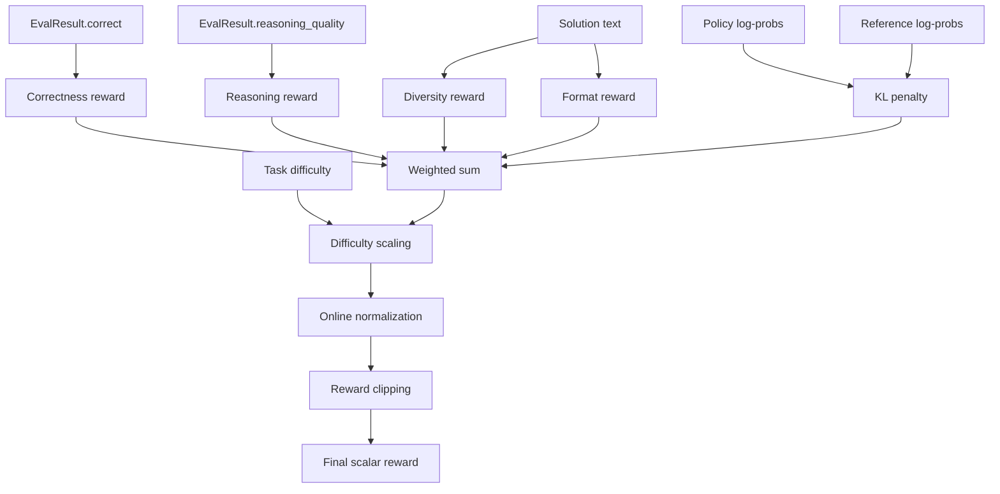

The reward is not just accuracy.

Accuracy is the strongest term.

Other terms shape training behavior.

The final scalar is what the optimizer sees.

---

## Checkpoint Behavior

Checkpoints store model and engine state.

The model checkpoint stores the LoRA adapter and tokenizer.

The engine state stores the curriculum.

The engine state stores reward normalization statistics.

The engine state stores replay buffer entries.

The engine state stores trainer metadata.

The best checkpoint path is:

```text
checkpoints/best_model
```

Periodic checkpoint paths look like:

```text
checkpoints/iter_500
checkpoints/iter_1000
checkpoints/iter_1500
```

The final checkpoint path is based on total iterations.

For the default configuration, the final path is:

```text
checkpoints/iter_5000_final
```

The trainer saves a final checkpoint after training completes.

If early stopping triggers, the final save still uses the configured total iteration number in the current implementation.

That detail is important when interpreting checkpoint names.

---

## Checkpoint Lifecycle Diagram

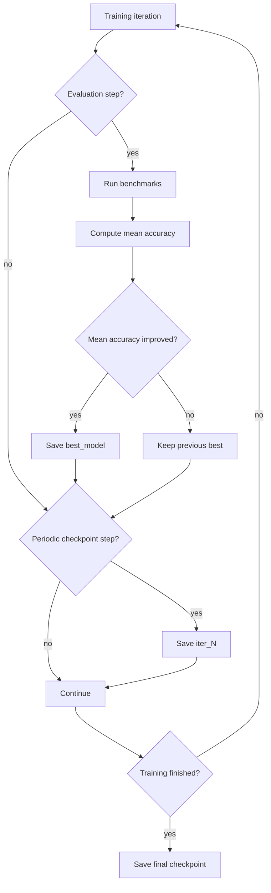

The best checkpoint is selected by benchmark mean accuracy.

Periodic checkpoints preserve progress.

The final checkpoint records the end state.

Resume training is easiest from `iter_N` checkpoints.

Evaluation is usually easiest from `best_model`.

---

## Benchmarking

The benchmark helper is in:

```text
src/evaluation/benchmarks.py
```

It currently supports:

- `gsm8k`
- `arc_easy`
- `arc_challenge`

GSM8K benchmark flow:

1. Load `openai/gsm8k`, `main`, test split.

2. Shuffle with seed 42.

3. Select up to `n_samples`.

4. Format the problem as a solve prompt.

5. Generate answer greedily.

6. Extract numeric answer.

7. Compare with reference numeric answer.

ARC benchmark flow:

1. Load `allenai/ai2_arc`.

2. Select `ARC-Easy` or `ARC-Challenge`.

3. Use the test split.

4. Shuffle with seed 42.

5. Format choices as `(A)`, `(B)`, etc.

6. Generate answer greedily.

7. Extract choice letter.

8. Compare with reference answer key.

Benchmarks are intentionally external to the generated training task stream.

That helps detect whether the engine is actually improving general reasoning.

---

## Metrics

Metrics utilities are in:

```text
src/evaluation/metrics.py
```

Available metric helpers include:

- `compute_accuracy`
- `compute_self_improvement_rate`
- `compute_diversity_score`
- `compute_generalization_gap`
- `compute_mean_reasoning_quality`
- `compute_reward_statistics`
- `compute_per_topic_accuracy`
- `compute_full_metrics`

Accuracy checks normalized exact match.

Self-improvement rate estimates improvement per 1000 iterations.

Diversity score uses n-gram Jaccard distance.

Generalization gap compares in-distribution and holdout accuracy.

Mean reasoning quality averages reasoning scores.

Reward statistics compute mean, standard deviation, min, max, and percentiles.

Per-topic accuracy groups correctness by topic.

Full metrics combines several metrics in one call.

These helpers are useful for reports and experiments.

They are separate from the main training loop.

---

## Hardware Profiles

### CPU Only

CPU-only mode is useful for import checks.

CPU-only mode is not recommended for serious training.

Use debug mode on CPU.

Expect generation to be slow.

Avoid full Phi-2 training on CPU.

### Around 6 GB VRAM

This is the target constrained setup.

Use quantization.

Use LoRA.

Use gradient checkpointing.

Use short sequence lengths.

Close other GPU applications.

Consider TinyLlama if Phi-2 fails to load.

Reduce rollout size if updates are too memory-heavy.

Reduce `max_seq_length` if generation memory is too high.

Reduce `max_new_tokens` if responses are too long.

### 8 GB To 12 GB VRAM

This is more comfortable for Phi-2 experiments.

The default config is more likely to run.

You may be able to increase rollout size modestly.

You may be able to increase sequence length modestly.

Keep an eye on memory fragmentation.

### 16 GB Or More VRAM

This allows more flexible experimentation.

You can consider larger batch sizes.

You can consider longer sequences.

You can consider independent reference model loading.

You can consider more expensive evaluation.

Still change one variable at a time.

---

## Common Commands

Create a virtual environment:

```bash
python -m venv .venv
```

Install dependencies:

```bash
pip install -r requirements.txt
```

Run setup:

```bash
python scripts/setup.py
```

Launch with automatic setup checks:

```bash
python scripts/launch.py --no-wandb
```

Train in debug mode:

```bash
python scripts/train.py --config config/training_config.yaml --debug --no-wandb
```

Train with the default config:

```bash
python scripts/train.py --config config/training_config.yaml --no-wandb
```

Resume from iteration 500:

```bash
python scripts/train.py --config config/training_config.yaml --resume checkpoints/iter_500 --no-wandb
```

Evaluate the best checkpoint:

```bash
python scripts/evaluate.py --checkpoint checkpoints/best_model --all-benchmarks
```

Evaluate with fewer samples:

```bash
python scripts/evaluate.py --checkpoint checkpoints/best_model --all-benchmarks --n-samples 50
```

Save evaluation JSON:

```bash
python scripts/evaluate.py --checkpoint checkpoints/best_model --all-benchmarks --output results.json
```

Create plots:

```bash
python scripts/visualize.py --log-dir logs/ --output-dir plots/
```

---

## Troubleshooting

### `No CUDA GPU detected`

PyTorch cannot see a CUDA device.

Check your PyTorch installation.

Check your GPU driver.

Check your CUDA runtime compatibility.

Use debug mode if you only want to test the code path.

### Out Of Memory During Model Load

Close other GPU-heavy programs.

Switch from Phi-2 to TinyLlama.

Keep quantization enabled.

Keep LoRA enabled.

Keep gradient checkpointing enabled.

Reduce sequence length.

Reduce generated token count.

### Out Of Memory During Training

Lower `training.rollout_size`.

Lower `training.update_batch_size`.

Lower `training.max_seq_length`.

Lower `training.max_new_tokens`.

Increase `gradient_accumulation_steps` only if the effective batch goal matters.

Avoid independent reference model loading.

### `bitsandbytes` Import Problems

Verify platform support.

Verify CUDA compatibility.

Install a compatible BitsAndBytes wheel.

Use debug mode if you only need to test control flow.

Expect higher memory use if the optimizer falls back to AdamW.

### Dataset Download Fails

Check internet access.

Check Hugging Face availability.

Retry `python scripts/setup.py`.

The training script may attempt dataset loading again.

### Generated Tasks Look Bad

Inspect task-generation prompts.

Reduce temperature.

Increase seed example quality.

Add stricter parsing.

Add validation before a task enters training.

Tune curriculum difficulty.

### Answers Are Often `UNPARSED`

Check the solution format.

Keep the `ANSWER:` instruction.

Lower temperature.

Increase max new tokens if answers are truncated.

Improve answer extraction patterns.

### Benchmark Accuracy Does Not Improve

Check generated task quality.

Check reward weights.

Check whether correctness dominates reward.

Check whether the model is overfitting generated task style.

Reduce reward shaping weights if they overpower correctness.

Increase benchmark sample count for more stable estimates.

Run debug only for control-flow testing, not for benchmark conclusions.

### Training Reward Improves But Benchmarks Do Not

The model may be optimizing the generated task distribution only.

The task generator may be too narrow.

The evaluator may be too forgiving.

The reward may be too shaped.

The curriculum may be staying on easy tasks.

External benchmarks are the stronger signal.

### Training Is Very Slow

Check whether CUDA is available.

Use a smaller base model.

Use fewer rollout trajectories.

Use fewer evaluation samples.

Evaluate less often.

Use debug mode for iteration testing.

---

## How To Read The Codebase

If you are new to the project, read files in this order.

1. `config/training_config.yaml`

2. `scripts/train.py`

3. `src/training/train_loop.py`

4. `src/modules/task_generator.py`

5. `src/modules/solution_generator.py`

6. `src/modules/evaluator.py`

7. `src/modules/reward_model.py`

8. `src/modules/replay_buffer.py`

9. `src/modules/curriculum.py`

10. `src/models/policy.py`

11. `src/training/ppo_trainer.py`

12. `src/evaluation/benchmarks.py`

13. `src/evaluation/metrics.py`

Start with the configuration.

Then read the training script to see object construction.

Then read the trainer loop to see runtime behavior.

Then read each module based on the order of the data flow.

This order avoids getting stuck in model-loading details too early.

---

## Development Notes

Keep changes scoped.

Most changes should affect one module at a time.

Change reward weights before rewriting the reward model.

Change curriculum thresholds before rewriting the scheduler.

Change generation settings before rewriting prompts.

Use debug mode after code edits.

Use small benchmark sample counts during iteration.

Use larger sample counts for final comparison.

Treat generated task quality as part of model quality.

Inspect both tasks and solutions when training behaves strangely.

Avoid comparing runs with different benchmark sample counts.

Avoid comparing runs with different decoding settings.

Avoid interpreting one noisy evaluation as proof of improvement.

Use checkpointed runs to compare before and after behavior.

Prefer changing one hyperparameter at a time.

Document command, config, model, and checkpoint when running serious experiments.

Do not commit large generated artifacts unless they are intentionally part of the project.

---

## Concept Checklist

Use this checklist to confirm you understand the engine.

- The policy is the trainable language model.
- The reference model anchors the policy with KL regularization.
- The curriculum chooses topic and difficulty.
- The task generator creates practice tasks.
- The solution generator produces answers and token log-probabilities.
- The evaluator checks correctness.
- The reasoning scorer estimates reasoning quality.
- The reward model computes one scalar reward.
- The replay buffer stores trajectories.
- The trainer samples replay and updates the policy.
- PPO limits destructive policy updates.
- The fallback update is simpler than PPO.
- LoRA reduces trainable parameter count.
- Quantization reduces base model memory.
- Reward shaping gives partial guidance.
- Benchmark evaluation checks external performance.
- Checkpoints store adapters and engine state.
- Debug mode tests the code path.
- Full training tests the research idea.

---

## Configuration Change Examples

### Use TinyLlama Instead Of Phi-2

Edit `config/training_config.yaml`:

```yaml
model:
  base_model: "TinyLlama/TinyLlama-1.1B-Chat-v1.0"
```

Then verify LoRA target modules.

Target module names may differ by model family.

### Reduce Memory Pressure

Edit:

```yaml
training:
  rollout_size: 8
  update_batch_size: 4
  max_seq_length: 256
  max_new_tokens: 128
```

Smaller values reduce memory pressure.

Smaller values may reduce training signal per iteration.

### Evaluate Less Often

Edit:

```yaml
logging:
  eval_every: 500
```

Less frequent evaluation saves time.

Less frequent evaluation also delays best-checkpoint updates.

### Make Curriculum More Conservative

Edit:

```yaml
curriculum:
  difficulty_step: 0.025
  success_threshold_up: 0.80
  success_threshold_down: 0.35
```

Smaller steps change difficulty more slowly.

Higher upward threshold demands stronger success before harder tasks.

### Increase Correctness Importance

Edit:

```yaml
reward:
  alpha_correctness: 0.80
  alpha_reasoning: 0.10
  alpha_diversity: 0.03
```

Make sure reward component weights remain intentional.

Correctness should usually remain the dominant term.

---

## Data Structures

### Task

`Task` represents one generated problem.

Fields:

- `task_id`
- `prompt`
- `problem`
- `reference_answer`
- `difficulty`
- `topic`
- `source`
- `metadata`

`prompt` is what the policy sees.

`problem` is the plain problem statement.

`reference_answer` is what the evaluator compares against.

`difficulty` is a float between 0 and 1.

`topic` is the curriculum category.

`source` describes where the task came from.

### Solution

`Solution` represents one policy response.

Fields:

- `text`
- `reasoning`
- `answer`
- `log_probs`
- `n_tokens`
- `n_retries`
- `metadata`

`text` is the raw generated response.

`reasoning` is extracted reasoning text.

`answer` is extracted final answer.

`log_probs` contains generated-token log-probabilities.

`n_tokens` counts generated tokens.

`n_retries` counts parse recovery attempts.

### EvalResult

`EvalResult` represents evaluator output.

Fields:

- `correct`
- `correctness_score`
- `reasoning_quality`
- `eval_mode`
- `details`

`correct` is the main boolean.

`correctness_score` is numeric.

`reasoning_quality` is between 0 and 1.

`eval_mode` describes matching mode.

`details` stores diagnostics.

### Trajectory

`Trajectory` represents one RL sample.

Fields:

- `task_id`
- `query`
- `response`
- `reward`
- `log_probs`
- `ref_log_probs`
- `eval_correct`
- `difficulty`
- `topic`
- `iteration`
- `hindsight`
- `metadata`

`query` is the task prompt.

`response` is the model output.

`reward` is the scalar training signal.

`hindsight` marks synthetic relabeling.

---

## Mermaid Overview Collection

This section groups the main diagrams for visual scanning.

### Closed Loop

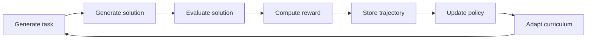

### Model Roles

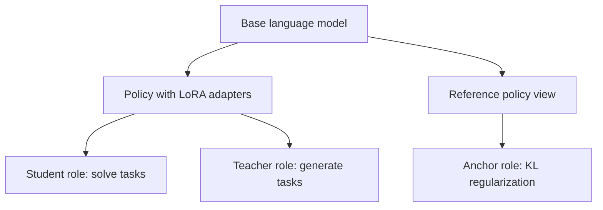

### Evaluation Modes

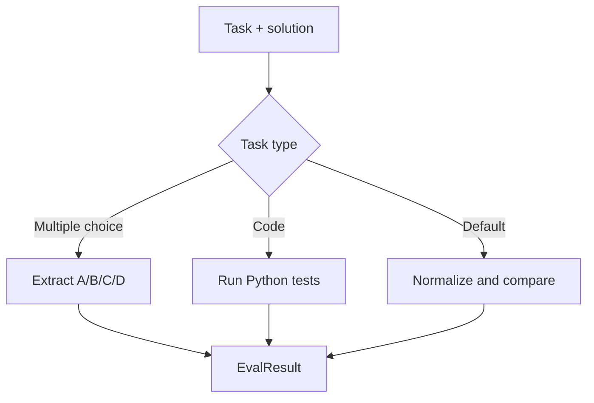

### Replay Sampling

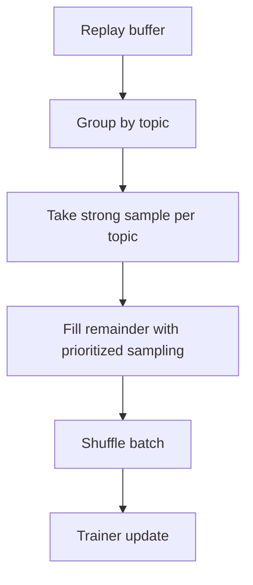

### Memory Strategy

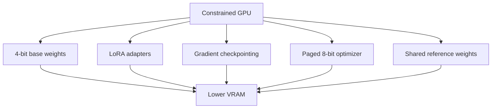

---

## Practical Reading Example

Suppose you want to understand how a reward is produced.

Start in `src/training/train_loop.py`.

Find `_collect_rollout`.

Notice that it calls `curriculum.get_next()`.

Notice that it calls `task_generator.generate()`.

Notice that it calls `solution_generator.generate()`.

Notice that it calls `evaluator.evaluate()`.

Notice that it calls `get_log_probs()` for the reference model.

Notice that it calls `reward_model.compute_reward()`.

Then open `src/modules/reward_model.py`.

Read `compute_reward`.

Then read `_correctness_reward`.

Then read `_reasoning_reward`.

Then read `_diversity_reward`.

Then read `_format_reward`.

Then read `_kl_penalty`.

This gives the complete reward path.

---

## Practical Experiment Path

A sensible first experiment is not full training.

Use this path:

1. Install dependencies.

2. Run setup.

3. Run debug training.

4. Confirm a checkpoint appears.

5. Run evaluation with a small sample count.

6. Switch to TinyLlama if VRAM is tight.

7. Run a short non-debug experiment.

8. Inspect generated tasks and solutions.

9. Tune reward weights if outputs are misaligned.

10. Tune curriculum if tasks are too easy or too hard.

11. Increase iterations.

12. Increase benchmark sample counts.

13. Compare best checkpoint to baseline.

This path reduces wasted time.

It also separates environment problems from research problems.

---

## Baseline Expectations

Treat benchmark numbers carefully.

Small sample counts are noisy.

Generated task quality affects training.

Hardware limits affect batch sizes and sequence lengths.

Model choice affects everything.

Debug mode is not expected to produce strong results.

TinyLlama can validate the loop but may have lower reasoning ability.

Phi-2 is the intended default for stronger reasoning experiments.

The current README does not claim guaranteed benchmark improvements.

You should measure baseline accuracy before training.

You should measure trained checkpoint accuracy after training.

You should use the same benchmark sample count for comparison.

You should use the same decoding method for comparison.

You should repeat experiments when making research claims.

---

## Safety And Validity Notes

Generated training tasks can be incorrect.

Generated reference answers can be incorrect.

The evaluator can be fooled by formatting.

The reasoning scorer is a learned heuristic.

The reward model is hand-designed.

The replay buffer may preserve flawed examples.

The curriculum can amplify weak areas.

Benchmark evaluation is the best sanity check in this repo.

For serious research, add task validation.

For serious research, sample and inspect trajectories.

For serious research, compare against baselines.

For serious research, track random seeds.

For serious research, record exact configuration.

For serious research, avoid drawing conclusions from one run.

---

## File Guide

### `scripts/setup.py`

Checks Python and CUDA.

Creates required directories.

Downloads datasets.

Use it before training.

### `scripts/launch.py`

Runs setup.

Checks VRAM.

Builds a training command.

Launches `scripts/train.py`.

Use it for a guided start.

### `scripts/train.py`

Loads config.

Applies debug overrides.

Loads models.

Builds modules.

Starts training.

This is the main entry point.

### `scripts/evaluate.py`

Loads base model.

Loads LoRA checkpoint.

Runs benchmarks.

Prints accuracy.

Optionally saves JSON.

### `scripts/visualize.py`

Reads metric records.

Plots training curves.

Can also use W&B run history.

### `src/models/policy.py`

Loads quantized policy model.

Applies LoRA.

Loads reference model.

Computes log-probabilities.

### `src/models/reasoning_scorer.py`

Loads NLI model.

Scores reasoning quality.

Extracts reasoning text.

### `src/models/value_head.py`

Defines a value head wrapper.

This supports value-estimation style modeling.

The main current training path uses TRL and fallback logic.

### `src/modules/task_generator.py`

Creates self-generated tasks.

Parses generated task fields.

Builds solve prompts.

### `src/modules/solution_generator.py`

Generates structured solutions.

Extracts answers.

Extracts reasoning.

Captures token log-probabilities.

### `src/modules/evaluator.py`

Checks correctness.

Handles exact, choice, and code tasks.

Adds reasoning quality.

### `src/modules/reward_model.py`

Computes composite reward.

Normalizes reward online.

Clips reward.

Saves and loads reward statistics.

### `src/modules/replay_buffer.py`

Stores trajectories.

Samples update batches.

Performs hindsight relabeling.

Saves and loads replay state.

### `src/modules/curriculum.py`

Samples topics.

Controls difficulty.

Tracks success.

Saves and loads curriculum state.

### `src/training/ppo_trainer.py`

Builds PPO configuration.

Builds PPO trainer.

Builds optimizer.

### `src/training/train_loop.py`

Runs the full training loop.

Collects rollouts.

Updates policy.

Evaluates benchmarks.

Saves checkpoints.

### `src/evaluation/benchmarks.py`

Runs GSM8K and ARC evaluations.

Formats benchmark prompts.

Extracts benchmark answers.

### `src/evaluation/metrics.py`

Computes reusable experiment metrics.

Useful for reports and comparisons.

---

## Glossary

### Action

In RL-SAGE, an action is a generated token.

The full response is a sequence of actions.

### Adapter

A small trainable module added to a larger frozen model.

LoRA adapters are the main trainable weights in the default setup.

### Advantage

An estimate of how much better an action was than expected.

PPO usually uses advantages rather than raw rewards.

### ARC

AI2 Reasoning Challenge.

RL-SAGE supports ARC-Easy and ARC-Challenge evaluation.

### Base Model

The pretrained language model before RL-SAGE updates.

The default is Phi-2.

### Benchmark

An external evaluation dataset used to measure performance.

GSM8K and ARC are included.

### Checkpoint

Saved model adapter and engine state.

Used for evaluation, resume, and comparison.

### Curriculum

A strategy for changing task difficulty and topic distribution over time.

### Difficulty

A float between 0 and 1 used to condition task generation.

### Entropy

A measure of distribution randomness.

Entropy bonuses can encourage exploration.

### Evaluation

The process of checking whether a generated answer is correct.

### Experience Replay

Storing past trajectories and sampling them for later updates.

### GSM8K

A grade-school math word problem benchmark.

RL-SAGE uses it for seeding and evaluation.

### KL Divergence

A measure of distribution difference.

Used to keep the policy close to the reference model.

### LoRA

Low-Rank Adaptation.

A parameter-efficient fine-tuning method.

### NLI

Natural Language Inference.

Used by the reasoning scorer as a coherence proxy.

### Policy

The model being optimized.

In RL-SAGE, the policy is a causal language model with adapters.

### PPO

Proximal Policy Optimization.

An RL algorithm that clips policy updates for stability.

### QLoRA

Quantized LoRA.

A memory-efficient method for adapter training on quantized base models.

### Reference Model

A fixed policy used for KL comparison.

It anchors the trainable policy.

### Reward

The scalar training signal.

RL-SAGE computes reward from correctness, reasoning, diversity, format, difficulty, and KL.

### Reward Hacking

Optimizing the reward in a way that does not solve the real task.

### Rollout

The process of generating trajectories with the current policy.

### Task

A generated problem with topic, difficulty, prompt, and reference answer.

### Trajectory

A complete training sample containing prompt, response, reward, and metadata.

### Welford Statistics

An online algorithm for mean and variance.

RL-SAGE uses it for reward normalization.

---

## License

MIT License.
