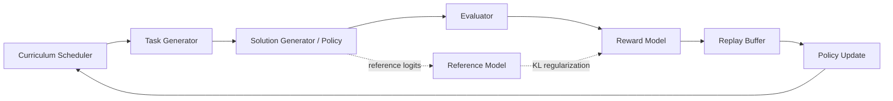
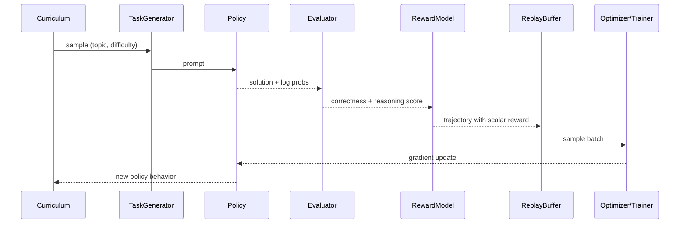
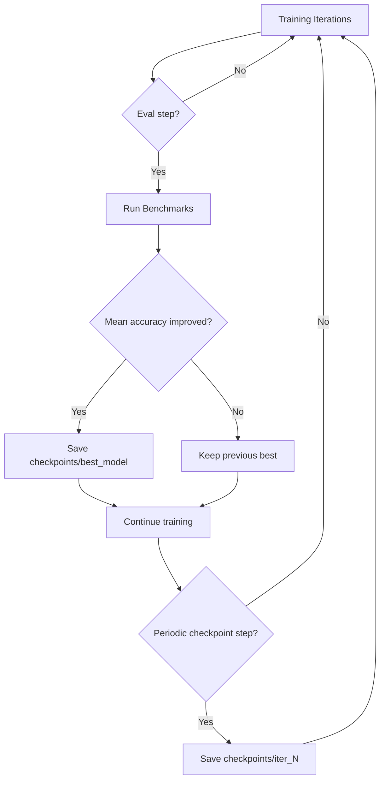

# RL-SAGE
## Reinforcement Learning Self-Adaptive Generation Engine

> A self-improving language model system that generates tasks, solves tasks,
> evaluates itself, and iteratively improves by reinforcement learning on a
> single GPU target of about 6 GB VRAM.

---

## Overview

RL-SAGE is a closed-loop self-improvement framework:

`Generate Task -> Solve Task -> Evaluate -> Compute Reward -> Policy Update -> Repeat`

The same system acts as:

- student (produces solutions)
- teacher (generates new tasks)
- evaluator (scores correctness + reasoning quality)

No manual labels are required during the RL phase.

## Key Features

- Self-supervised RL loop with online curriculum
- 6 GB VRAM-aware design with quantization + LoRA
- Checkpointed training state (model + curriculum + replay + reward stats)
- Modular components for policy, evaluator, reward, replay, and benchmarking
- Built-in benchmark evaluation for GSM8K and ARC

## Hardware Requirements

| Component | Minimum | Recommended |
|---|---|---|
| GPU | 6 GB VRAM | 8+ GB VRAM |
| RAM | 16 GB | 32 GB |
| CPU | Laptop i5/Ryzen 5 | i7/Ryzen 7 |
| Storage | 20 GB SSD | 50+ GB SSD |

## Project Structure

```text
rl-sage/
|- config/
|  |- training_config.yaml
|- data/
|  |- gsm8k/
|  |- arc/
|  `- humaneval/
|- src/
|  |- models/
|  |- modules/
|  |- training/
|  `- evaluation/
|- scripts/
|  |- setup.py
|  |- train.py
|  |- evaluate.py
|  |- launch.py
|  `- visualize.py
|- checkpoints/
|- logs/
|- requirements.txt
`- README.md
```

---

## System Architecture (Mermaid)



## One Training Iteration (Mermaid Sequence)



## Checkpoint Lifecycle (Mermaid)



---

## Quick Start

### 1. Install dependencies

```bash
pip install -r requirements.txt
```

### 2. Run environment and dataset bootstrap

```bash
python scripts/setup.py
```

### 3. Start full training

```bash
python scripts/train.py --config config/training_config.yaml --no-wandb
```

### 4. Evaluate a checkpoint

```bash
python scripts/evaluate.py --checkpoint checkpoints/best_model --benchmarks gsm8k arc_easy arc_challenge
```

### 5. Visualize training curves

```bash
python scripts/visualize.py --log-dir logs/
```

---

## Theoretical Foundations

### 1) RL Objective

The policy is trained to maximize expected return over generated trajectories:

`J(theta) = E_tau~pi_theta [ sum_t r_t ]`

In RL-SAGE, each trajectory reward is a weighted composition of:

- task correctness
- reasoning quality
- diversity (anti-collapse)
- output format quality
- KL penalty against a reference policy

### 2) PPO-Style Stabilization

PPO constrains policy updates by clipping the probability ratio:

`L_clip(theta) = E[min(r_t(theta) * A_t, clip(r_t(theta), 1-eps, 1+eps) * A_t)]`

where `r_t(theta) = pi_theta(a_t|s_t) / pi_theta_old(a_t|s_t)`.

This limits destructive updates and improves stability over naive policy gradient.

### 3) KL Regularization

RL-SAGE penalizes divergence from a frozen (or weight-shared) reference model:

`R_total = R_task - beta * KL(pi_theta || pi_ref)`

This discourages reward hacking and catastrophic drift.

### 4) Curriculum Learning as Distribution Shaping

The curriculum scheduler adaptively changes task difficulty and topic mix based on
recent success rates. In effect, it controls the training distribution:

`p(task | t) -> p(task | success_history_t)`

This keeps the model near the "learning frontier" rather than saturating on easy
tasks or collapsing on overly hard tasks.

### 5) Why QLoRA Matters Here

QLoRA allows training adapters on quantized base weights, reducing memory while
preserving useful gradient pathways. The practical effect is:

- lower VRAM footprint (4-bit base + low-rank trainable adapters)
- feasible fine-tuning on consumer GPUs
- easy checkpoint portability (adapter-centric saves)

### 6) Replay Buffer Intuition

The replay buffer stores trajectories and supports non-uniform sampling. This can
reduce variance and improve sample efficiency compared to strictly on-policy
single-pass updates.

---

## Training Modes

| Mode | Typical Setting | Purpose |
|---|---|---|
| Debug | `distilgpt2`, low iterations | Sanity-check code path |
| Fast | `TinyLlama`, medium iterations | Short experiment cycle |
| Full | `microsoft/phi-2`, 5000 iterations | Main research run |

## Expected Results (Phi-2, Long Run)

| Benchmark | Baseline | Post RL-SAGE (target range) |
|---|---|---|
| GSM8K | ~57% | 62-68% |
| ARC-Easy | ~75% | 78-82% |
| ARC-Challenge | ~54% | 57-62% |

## Practical Completion Checklist

- training process completed target iterations or intentional early stop
- final checkpoint saved (not only `best_model`)
- benchmark evaluation executed on final and best checkpoints
- logs and plots exported for reportability
- config + command used for the run captured in experiment notes

## Notes

- Current logs are written to `logs/metrics.jsonl`.
- `checkpoints/best_model` stores the best eval snapshot and engine state.
- If your TRL version has no `PPOTrainer.step()`, the trainer uses a compatible
  fallback optimization path so training can still proceed.

## Citation / Reference

```text
RL-SAGE: Reinforcement Learning Self-Adaptive Generation Engine
Self-improving language models via self-play RL on resource-constrained hardware
March 2026
```

## License

MIT License.
